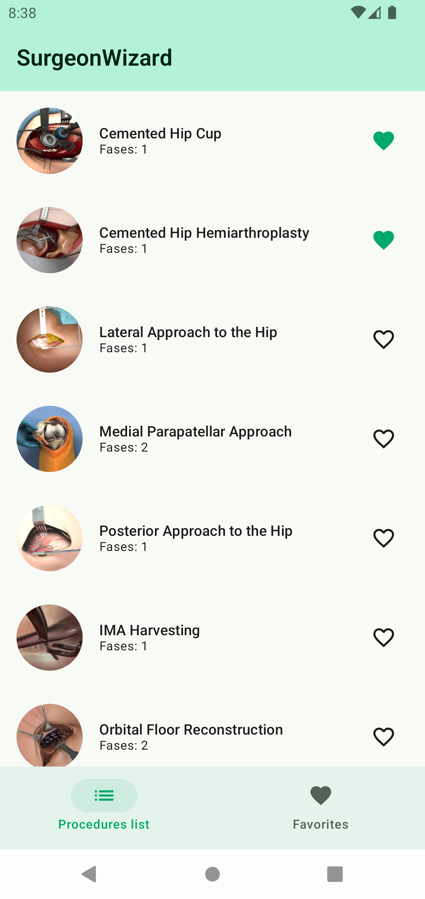
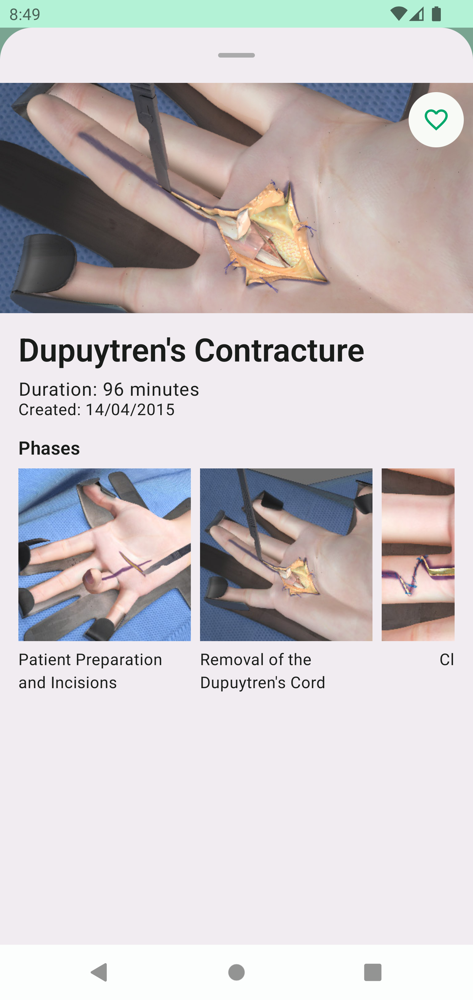
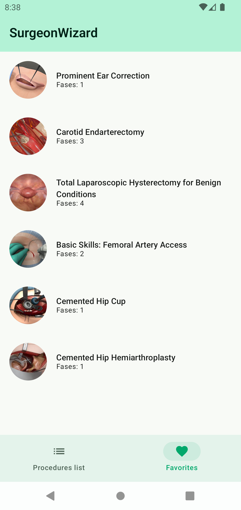
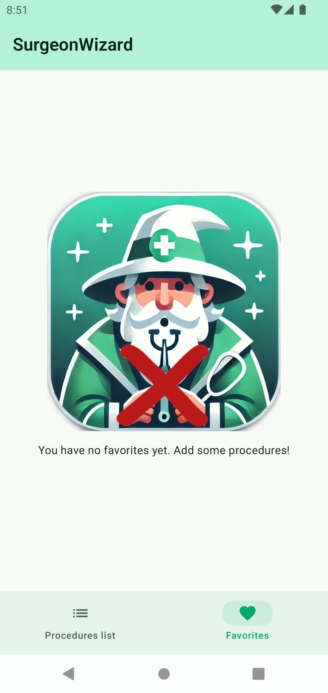
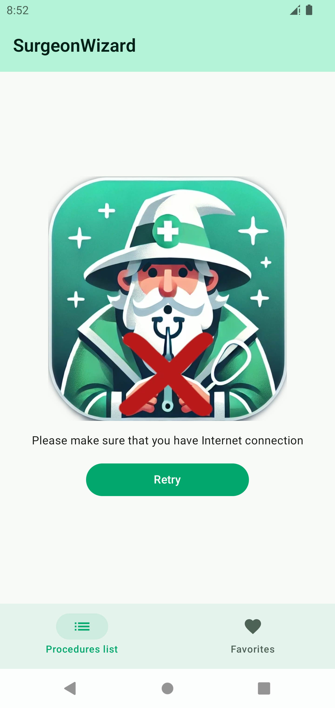

# Getting to know WizardSurgeon

WizardSurgeon is an Android application that provides a comprehensive catalog of magical medical procedures, allowing users to explore, learn, and save their favorite healing techniques.

## Features

    

- **Procedure Library:** Browse an extensive list of magical medical procedures.
- **Detailed Insights:** Access in-depth information about each procedure, including duration, publication date, phases, and illustrative images.
- **Favorite Selection:** Mark procedures as favorites for quick future reference.
- **Personalized List:** View a curated list of your favorite procedures for easy access.

## Module Structure

WizardSurgeon is built using a multi-module architecture:

- `app`: Main application module
- `core`: Contains core utilities and common code
- `data`: Contains the data layer
- `domain`: Contains the domain layer
- `design`: Contains shared drawables and design system definitions
- `feature:procedures`: Contains procedures lists and details features

## Architecture

WizardSurgeon follows Clean Architecture principles, separated into three main layers:

1. **Presentation Layer**
  - Contains UI-related components (Composables, ViewModels)
  - Implements the chosen presentation pattern (in this case MVVM with a touch of UDF)
  - Responsible for displaying data to the user and handling user interactions
  - Communicates with the Domain Layer to retrieve and send data

2. **Domain Layer**
  - Houses the core business logic and rules of the application
  - In this case, it doesn't contain any UseCase/Interactor, as they would have been anaemic
  - Defines interfaces for repositories (implemented in the Data Layer)
  - Acts as a bridge between the Presentation and Data layers
  - Independent of any framework or UI implementation

3. **Data Layer**
  - Manages data operations and sources (local Room database, network, etc.)
  - Implements repository interfaces defined in the Domain Layer
  - Handles data mapping between domain entities and data models
  - Responsible for choosing the appropriate data source for operations
  - Handles the cache (in this case a cache with a TTL of 24 hours)

### Layer Relationships

- **Presentation → Domain**: The Presentation Layer depends on the Domain Layer, using Repositories (in this case IProcedureRepository) to perform operations and retrieve data. It doesn't know about the Data Layer implementation.

- **Domain ← → Data**: The Domain Layer defines repository interfaces, which are implemented by the Data Layer. This allows the Domain Layer to remain independent of data source implementations.

- **Presentation ↛ Data**: There's no direct communication between the Presentation and Data layers, maintaining a clear separation of concerns.

### Data Flow

1. User interacts with the UI (Presentation Layer)
2. Presentation Layer calls appropriate Repository function (defined in Domain, implemented in Data)
3. Data Layer retrieves/manipulates data and returns results. The Repository coreographs and organize the different data sources.
4. Results flow back through Domain to Presentation
5. UI updates to reflect the new data

## Presentation Pattern: MVVM with Unidirectional Data Flow (MVVM-UDF)

The project follows an hybrid approach combining MVVM (Model-View-ViewModel) with principles of Unidirectional Data Flow (UDF). Here's a breakdown of the key components from an example (`ProcedureDetail`):

### 1. ViewModel (MVVM)
- The `ProcedureDetailViewModel` class extends `ViewModel`, a core component of MVVM in Android.

### 2. State Management (UDF aspect)
- Manages `_viewState: MutableStateFlow<ProcedureDetailViewState>`
- Exposes immutable `viewState: StateFlow<ProcedureDetailViewState>` to the UI

### 3. Event Handling (UDF aspect)
- Uses `_viewEvent: MutableSharedFlow<ProcedureDetailEvent>` for one-time events

### 4. Unidirectional Data Flow
- Data flows: ViewModel -> UI via `viewState` StateFlow
- User actions in UI trigger ViewModel functions
- Functions update state, which flows back to UI

### 5. Composable UI (View in MVVM)
- `ProcedureDetailBottomSheet` composable function represents the View
- Observes `viewState` and `viewEvent`, reacting to changes

### 6. State Hoisting
- State is "hoisted" to the ViewModel
- UI components remain stateless, improving testability and reusability

## Testing

The following testing strategies have been employed:

- Unit Tests: For testing individual components and functions as in `ProcedureRepositoryTest`, `ProcedureDetailViewModelTest` or `ProcedureListViewModelTest`
- Instrumentation Tests: Testing the correct behaviour of the Dao in an in-memory database (`ProceduresDatabasetest`)
- UI Tests: Using `ComposeTestRule` and testing the detail view (`ProcedureDetailTest`). The robot pattern is for readability and reusability.

## Static analysis

- Ktlint have been added as linter, to also take advantage of its automatic formatting

## Trade-offs

In developing WizardSurgeon, there have been some trade-off that I have chosen to leave out:

### Pagination
I chose not to implement pagination for the procedure lists in the initial version of WizardSurgeon. This decision simplifies the UI implementation and data loading logic, which is suitable for our current relatively small dataset. However, as the number of procedures grows, we may need to implement pagination to improve performance and reduce resource usage, especially on devices with limited capabilities.

### Database Structure for Phases
The phases of procedures are stored as JSON within the procedures table, rather than having their own separate table. This approach simplifies the database structure and read/write operations, avoiding over-engineering for data that is not expected to change frequently. While this may make specific searches or filtering based on phases more challenging, it reduces query complexity and table relationships. If phases require frequent or independent updates in the future, we may need to revisit this decision.

## Thank You!

Thank you for taking the time to read through this documentation and to review the code.

Remember, in the world of magical medical procedures, as in Middle-earth, "Not all those who wander are lost." Your journey through WizardSurgeon may lead to unexpected discoveries!

If you encounter any issues while running the app or have any questions about its implementation, please don't hesitate to reach out.

Happy wizarding! 🧙‍♂️🔮